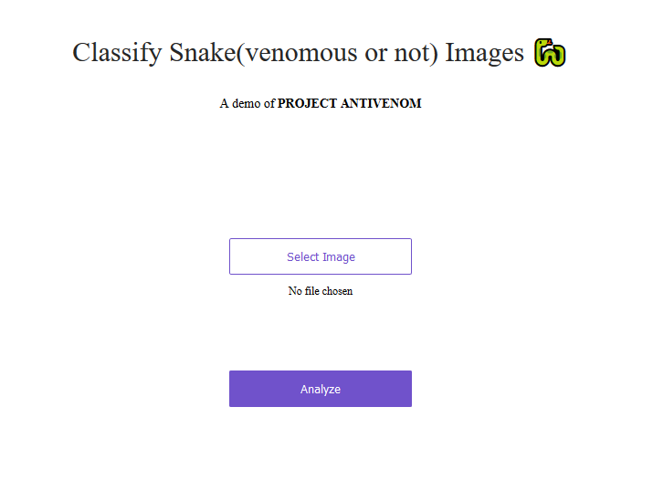

# Project-AV 

A simple Python based machine learning application which determines the type of snake present in the uploaded image.

## Contributions
Look at [Contributors.md](contributors.md) for more.

## Help Needed
**Problem **: When the application is given an image which doesn't have any snake in it, desired output is not achieved.
*Expected Output_ : Result = Snake is not present in the picture.

If anyone interested in solving this issue kindly fork it, fix it, describe it and create a PR.

**website** : project-av.onrender.com